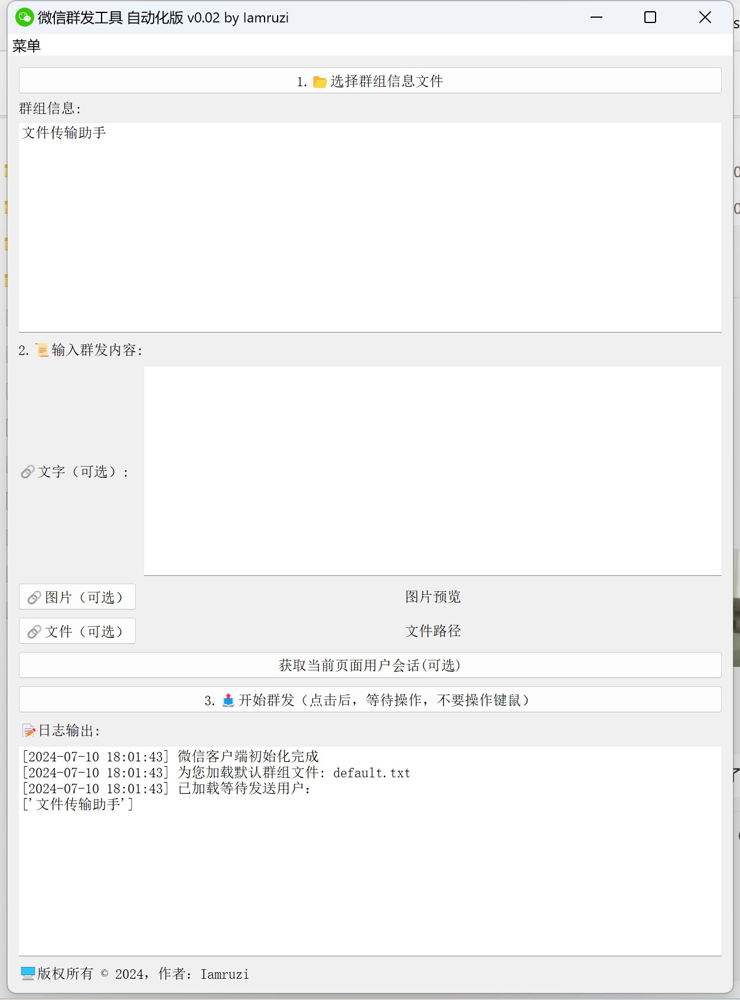

# WeChatMessagingAssistant（非接口版）

一个基于wxauto与pyqt5实现的微信群发自动化工具，可以为输入用户，群发文字，图像，文件

首先感谢wxauto作者 repo地址：https://github.com/cluic/wxauto

## 如何使用

### 1. 安装库
 （1）基本库
    ```
    pip install wxauto pyqt5
    ```

 （2）如果你要打包exe
    ```
    pip install pyinstaller
    ```
 
 （3）打包
    ```
    pyinstaller --noconsole --onefile --icon wx.png WeChatMessagingAssistantGuiApp.py
    ```

    打包后，在dist目录下会生成一个exe文件

### 2. 运行程序

库安装好后，要不就 python WeChatMessagingAssistantGuiApp.py

要不就双击你自己打包的exe文件

### 3. 程序界面



### 运行程序注意事项

1. 确保程序所在目录为非中文路径，且微信为默认语言：中文
2. 程序启动会优先加载default.txt,你也可以手动指定
3. 至于不想一个个手打，可以用程序里自动抓取用户的功能，拿下来手动排版，生成你自己的users.txt
4. 程序使用过程也都标记的顺序，不懂可以打开 【菜单--使用说明】

### 其他

咨询探索，有其他想法，可以folk自己改着玩，或者有问题联系我。

